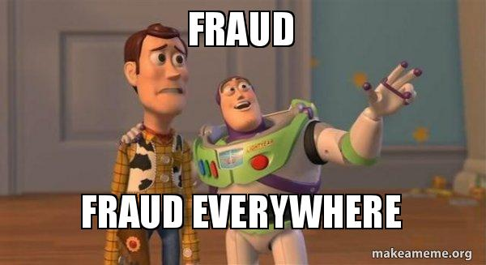

# Fraud Detection Case Study

By: Martha Wood, Justin Lansdale, Alex Wyman, and Jeff Bauerle

<!------>

# The Scope

Fraud is difficult to detect and can be devastating when it slips through the cracks. Because more and more of our transactions take place online, it is becoming easier for fraudsters to take advantage of us. E-commerce sales will reach $710 billion by the end 2020 and fraudsters are taking a staggering $14 billion cut.  In order to prevent this from occuring, we need to evolve our way of thinking about fraud detection.

One of the many ways that fraudsters take advantage of people is through ticket sales.  Fraud is commited utilizing fake events to attract ticket sales and e-commerce companies usually end up taking the hit.  

# The Strategy

#1 Exploratory Data Analysis and Remove Leaky Features
#2 Engineer Feature to Train a Model
#3 Train the Model
#4 Test the Model on a Holdout Set
#5 Deploy the Model
#6 Verify the Model with Live Data

# EDA

Reviewed each of the features to try to discern what we thought it represented, relative importance, and whether we thought it contained data leakage. 

### Data Leakage (removed)
1. Account Type (acct_type)
2. Global Ticket Sales (gts)
3. Approximate Payout Date (approx_payout_date)
4. Number of Payouts (num_payouts)
5. Sale Duration (sale_duration, sale_duration2)
6. Payee Name (payee_name)
7. Payout Type (payout_type)

| Feature | Not Fraud                   | Fraud              |
:-----------------------------:|:------------------:|:------:|
 Name    | |  |
| Feature | Not Fraud                   | Fraud              |
 Organization    | |  |
| Feature | Not Fraud                   | Fraud              |
 Venue    | |  |

# Feature Engineering

1. A Naive Bayes model was applied to the description to get a predict proba - the model was pickled, and then inserted as a feature into the main Random Forest model.

2. We engineered a feature to determine how similar the subdomain of the email is to organization name, theorizing that more professional and legitimate organizations will have higher similarity and be less prone to be fraud. This was created by using the FuzzyWuzzy package which calculates the [Levenshtein distance](https://en.wikipedia.org/wiki/Levenshtein_distance) between two strings.

3. "Public Notification Period" - Total number of days that had elapsed between when the event had been published and the starting time of the event

4. "Private Notification Period" - Total number of days between the time the event was created and the start time of the event.

5. "Previous Payouts" - Total Number of previous payouts that the user had recieved before creating the new event.

6. "Percent Capitalized" - evaluated how much of the name contained capital letters. 

Feature Importance:

# Model

We used a random forest model in combination with a Naive Bayes text classification model to obtian an F1 Score of 93.8% 

Predicted | Fraud | Not Fraud
---------|----------|---------
 **1** | 419 | 12
 **0**| 84 | 221

# Detection System App

Fraud was categorized into low risk (<20% probability), medium risk (20%-70% probability) and high risk (over 70% probability). 

A [Flask app](http://ec2-34-213-246-20.us-west-2.compute.amazonaws.com:8105) was published to the web to allow users to view fraud risk in real time. The user can the decide to start an investigation or mark the event as not fraudulent. The features with the most importance are listed on the home page with the risk assessment and name of the event. 

After determining the probability of fraud each event is stored in a Postgres database. 

